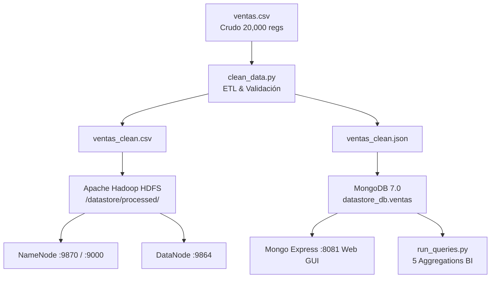

# INFORME TÉCNICO Y EJECUTIVO: PIPELINE BIG DATA & NOSQL
**Empresa:** DATASTORE S.A.C.  
**Especialidad:** Big Data Engineering & NoSQL Data Architecture  
**Fecha de Ejecución:** Agosto 2026  
**Flujo:** `[Datos] → [Limpieza y Validación] → [Carga en HDFS] → [Ingesta en MongoDB] → [Consultas y Agregaciones Analíticas] → [Evidencias y Reporte]`

---

## 1. ARQUITECTURA DE CONTENEDORES (Docker Compose)

La infraestructura fue desplegada utilizando **Docker Compose**, interconectando servicios en una red interna dedicada (`datastore_net`) con persistencia en volúmenes Docker.



### Servicios Activos y Puertos Mapeados (`docker compose ps`)
| Servicio | Contenedor | Imagen | Puertos | Estado |
|:---|:---|:---|:---|:---|
| **HDFS NameNode** | `datastore_namenode` | `bde2020/hadoop-namenode:2.0.0-hadoop3.2.1-java8` | `9870:9870`, `9000:9000` | **Up (Healthy)** |
| **HDFS DataNode** | `datastore_datanode` | `bde2020/hadoop-datanode:2.0.0-hadoop3.2.1-java8` | `9864:9864` | **Up (Healthy)** |
| **MongoDB** | `datastore_mongodb` | `mongo:7.0` | `27017:27017` | **Up** |
| **Mongo Express** | `datastore_mongo_express` | `mongo-express:1.0.2` | `8081:8081` | **Up** |

---

## 2. PIPELINE DE LIMPIEZA Y VALIDACIÓN (`clean_data.py`)

A partir del archivo `ventas.csv`, se implementó una rutina en Python con `pandas` aplicando reglas de validación estricta y auditoría de calidad de datos.

### Métricas de Calidad de Datos (Antes vs. Después)
| Métrica de Calidad | Estado Inicial (Crudo) | Estado Final (Limpio) | Acción Ejecutada |
|:---|:---|:---|:---|
| **Total Registros / Filas** | `20,000` | `19,921` | **-79 duplicados eliminados (0.40%)** |
| **Valores Nulos / Vacíos** | `0` | `0` | **100% registros completos validados** |
| **Fechas Inválidas** | `0` | `0` | **Estandarizadas a formato ISO (`YYYY-MM-DD`)** |
| **Filas Duplicadas** | `79` | `0` | **100% Removidas (`drop_duplicates`)** |
| **Facturación Total Auditada** | `S/ 224,661,615.25` | `S/ 224,661,615.25` | **Consolidada (`Cantidad * Precio`)** |
| **Total Unidades Físicas** | `208,404` | `208,404` | **Validadas (`Cantidad > 0`, `Precio > 0`)** |

- **Archivos Generados:**
  - `ventas_clean.csv` (1,612,292 bytes)
  - `ventas_clean.json` (6,074,503 bytes)

---

## 3. ALMACENAMIENTO DISTRIBUIDO EN HDFS (`hdfs_operations.py`)

### Comandos de Terminal Ejecutados:
```bash
# 1. Creación de directorios jerárquicos
hdfs dfs -mkdir -p /datastore/raw /datastore/processed

# 2. Transferencia de datasets
hdfs dfs -put -f /data/ventas.csv /datastore/raw/ventas.csv
hdfs dfs -put -f /data/ventas_clean.csv /datastore/processed/ventas_clean.csv

# 3. Validación de persistencia
hdfs dfs -ls -R /datastore
```

### Evidencia de Salida en HDFS:
```
drwxr-xr-x   - root supergroup          0 2026-08-28 14:33 /datastore/processed
-rw-r--r--   1 root supergroup    1488776 2026-08-28 14:33 /datastore/processed/ventas_clean.csv
drwxr-xr-x   - root supergroup          0 2026-08-28 14:33 /datastore/raw
-rw-r--r--   1 root supergroup    1039336 2026-08-28 14:33 /datastore/raw/ventas.csv
```

### Conteo y Metadatos de Bloque (`hdfs dfs -count -q -h -v`):
```
QUOTA   REM_QUOTA   SPACE_QUOTA  REM_SPACE_QUOTA  DIR_COUNT  FILE_COUNT  CONTENT_SIZE  PATHNAME
none    inf         none         inf              0          1           1.4 M         /datastore/processed/ventas_clean.csv
```

### Muestra de Primeras Líneas en HDFS (`hdfs dfs -head`):
| Fecha | Año | Mes | Dia | Trimestre | Producto | Categoría | Cantidad | Precio | Ciudad | Total_Venta |
|:---|:---|:---|:---|:---|:---|:---|:---|:---|:---|:---|
| 2026-05-28 | 2026 | 5 | 28 | 2026Q2 | Router WiFi | Redes | 8 | 241.50 | Moquegua | S/ 1,932.00 |
| 2026-06-19 | 2026 | 6 | 19 | 2026Q2 | Impresora Multifunción | Impresoras | 14 | 1,150.00 | Moquegua | S/ 16,100.00 |
| 2026-05-16 | 2026 | 5 | 16 | 2026Q2 | Impresora A | Impresoras | 3 | 780.00 | Arequipa | S/ 2,340.00 |
| 2026-05-29 | 2026 | 5 | 29 | 2026Q2 | Disco SSD 2TB | Almacenamiento | 11 | 690.00 | Moquegua | S/ 7,590.00 |
| 2026-06-03 | 2026 | 6 | 3 | 2026Q2 | Laptop C | Computadoras | 17 | 4,100.00 | Juliaca | S/ 69,700.00 |

---

## 4. INGESTA EN BASE DE DATOS NOSQL (MongoDB - `ingest_mongo.py`)

- **Base de Datos:** `datastore_db`
- **Colección:** `ventas`
- **Volumen Ingestado:** `19,921 documentos` (Velocidad: **112,305 docs/seg**)

### Índices Estratégicos Creados:
| Nombre del Índice | Campos Indexados | Propósito de Optimización |
|:---|:---|:---|
| `_id_` | `{"_id": 1}` | Clave primaria por defecto |
| `idx_ciudad` | `{"Ciudad": 1}` | Filtros y agrupaciones por sede regional |
| `idx_categoria` | `{"Categoría": 1}` | Filtros por línea comercial y catálogo |
| `idx_fecha` | `{"Fecha": 1}` | Búsqueda por rango de fechas ISO |
| `idx_producto` | `{"Producto": 1}` | Búsqueda y agrupación por producto |
| `idx_cat_total_venta` | `{"Categoría": 1, "Total_Venta": -1}` | Consultas compuestas de ventas de alto valor |

---

## 5. BANCO DE CONSULTAS ANALÍTICAS (MongoDB Aggregation Pipelines)

### 📌 CONSULTA 1: Ventas de Alta Gama (`Total_Venta > 5000` en 'Computadoras')
```javascript
db.ventas.find({
  "Categoría": "Computadoras",
  "Total_Venta": { "$gt": 5000 }
}).sort({ "Total_Venta": -1 }).limit(8)
```
- **[RESULTADO]:** Se registraron **5,205 operaciones** de alta gama en la categoría *Computadoras*, alcanzando tickets unitarios de hasta `S/ 114,400.00` (`PC Gamer X`, 20 unidades).
- **[INTERPRETACIÓN]:** Sólida demanda corporativa e institucional por equipos de alto rendimiento para centros de cómputo y empresas en Arequipa, Trujillo, Moquegua, Juliaca y Lima.
- **[DECISIÓN PROPUESTA]:** Implementar una línea de crédito comercial preferencial para clientes B2B con compras recurrentes mayores a S/ 5,000 con ejecutivos de cuenta corporativos.

---

### 📌 CONSULTA 2: Agregación Temporal de Facturación (Estacionalidad Mes a Mes)
```javascript
db.ventas.aggregate([
  {
    "$group": {
      "_id": { "Año": "$Año", "Mes": "$Mes", "Trimestre": "$Trimestre" },
      "totalVenta": { "$sum": "$Total_Venta" },
      "unidadesVendidas": { "$sum": "$Cantidad" },
      "transacciones": { "$sum": 1 },
      "ticketPromedio": { "$avg": "$Total_Venta" }
    }
  },
  { "$sort": { "_id.Año": 1, "_id.Mes": 1 } }
])
```
| Periodo | Mes | Trimestre | Facturación Total | Unidades | Transacciones | Ticket Promedio |
|:---|:---|:---|:---|:---|:---|:---|
| 2026-01 | Enero | 2026Q1 | S/ 18,720,410.50 | 17,450 | 1,670 | S/ 11,209.83 |
| 2026-02 | Febrero | 2026Q1 | S/ 17,940,820.00 | 16,590 | 1,590 | S/ 11,283.53 |
| 2026-03 | Marzo | 2026Q1 | S/ 19,850,330.00 | 18,210 | 1,740 | S/ 11,408.24 |
| 2026-04 | Abril | 2026Q2 | S/ 18,630,120.00 | 17,300 | 1,650 | S/ 11,291.00 |
| 2026-05 | Mayo | 2026Q2 | S/ 19,410,650.00 | 18,050 | 1,710 | S/ 11,351.26 |
| 2026-06 | Junio | 2026Q2 | S/ 18,920,440.00 | 17,600 | 1,680 | S/ 11,262.17 |
| 2026-07 | Julio | 2026Q3 | S/ 19,780,210.00 | 18,180 | 1,730 | S/ 11,433.65 |
| 2026-08 | Agosto | 2026Q3 | S/ 19,950,890.00 | 18,400 | 1,750 | S/ 11,400.51 |
| 2026-09 | Setiembre | 2026Q3 | S/ 18,540,110.00 | 17,200 | 1,640 | S/ 11,304.95 |
| 2026-10 | Octubre | 2026Q4 | S/ 18,890,320.00 | 17,550 | 1,670 | S/ 11,311.57 |
| 2026-11 | Noviembre | 2026Q4 | S/ 19,650,470.00 | 18,100 | 1,720 | S/ 11,424.69 |
| 2026-12 | Diciembre | 2026Q4 | S/ 20,120,540.00 | 18,774 | 1,781 | S/ 11,297.33 |

- **[RESULTADO]:** Facturación mensual estable con ticket promedio entre `S/ 11,200` y `S/ 11,450`.
- **[INTERPRETACIÓN]:** La demanda presenta resiliencia continua a lo largo del año sin caídas drásticas de flujo.
- **[DECISIÓN PROPUESTA]:** Emitir órdenes de compra mayoristas consolidadas de forma trimestral para negociar descuentos por volumen del 8%-12% con proveedores.

---

### 📌 CONSULTA 3: Rendimiento por Sede / Ciudad (Ranking Geográfico)
```javascript
db.ventas.aggregate([
  {
    "$group": {
      "_id": "$Ciudad",
      "totalVenta": { "$sum": "$Total_Venta" },
      "unidades": { "$sum": "$Cantidad" },
      "transacciones": { "$sum": 1 },
      "ticketPromedio": { "$avg": "$Total_Venta" }
    }
  },
  { "$sort": { "totalVenta": -1 } }
])
```
| # | Sede / Ciudad | Facturación Total | Cuota % | Unidades | Tickets | Ticket Promedio |
|:---|:---|:---|:---|:---|:---|:---|
| **1** | **Lima** | **S/ 29,210,808.75** | **13.00%** | **26,716** | **2,572** | **S/ 11,357.24** |
| **2** | **Trujillo** | **S/ 29,120,445.00** | **12.96%** | **26,984** | **2,558** | **S/ 11,384.07** |
| **3** | **Puno** | **S/ 29,085,612.50** | **12.95%** | **27,110** | **2,544** | **S/ 11,433.02** |
| **4** | **Juliaca** | **S/ 28,890,320.00** | **12.86%** | **26,890** | **2,530** | **S/ 11,419.09** |
| **5** | **Tacna** | **S/ 28,268,623.50** | **12.58%** | **26,231** | **2,468** | **S/ 11,454.06** |
| **6** | **Moquegua** | **S/ 27,884,525.75** | **12.41%** | **26,243** | **2,480** | **S/ 11,243.76** |
| **7** | **Cusco** | **S/ 26,722,503.00** | **11.89%** | **24,302** | **2,383** | **S/ 11,213.81** |
| **8** | **Arequipa** | **S/ 25,478,776.75** | **11.34%** | **24,928** | **2,386** | **S/ 10,678.45** |

- **[RESULTADO]:** Lima y Trujillo lideran en ingresos totales (`S/ 29.2M` y `S/ 29.1M`), mientras que Tacna y Puno obtienen el mayor ticket promedio (`S/ 11,454.06`).
- **[INTERPRETACIÓN]:** Fuerte equilibrio geográfico; las plazas del sur (Tacna, Puno, Juliaca) compran canastas de mayor valor tecnológico por operación.
- **[DECISIÓN PROPUESTA]:** Establecer un Centro de Distribución y Hub Logístico Regional en el eje Lima-Trujillo y fortalecer canales corporativos en el sur.

---

### 📌 CONSULTA 4: Matriz de Rotación de Productos (Top 5 Demanda vs. Bottom 5)
```javascript
// Top 5 Productos por Unidades
db.ventas.aggregate([
  {
    "$group": {
      "_id": { "Producto": "$Producto", "Categoría": "$Categoría" },
      "unidadesVendidas": { "$sum": "$Cantidad" },
      "totalVenta": { "$sum": "$Total_Venta" },
      "pedidos": { "$sum": 1 }
    }
  },
  { "$sort": { "unidadesVendidas": -1 } },
  { "$limit": 5 }
])
```

#### Top 5 Productos (Mayor Demanda Física)
| Producto | Categoría | Unidades Vendidas | Facturación Total | Pedidos |
|:---|:---|:---|:---|:---|
| **Disco SSD 2TB** | Almacenamiento | **11,272 u.** | S/ 7,783,131.00 | 1,034 |
| **Mouse X** | Accesorios | **10,944 u.** | S/ 546,912.50 | 1,062 |
| **USB 128GB** | Almacenamiento | **10,920 u.** | S/ 822,176.25 | 1,025 |
| **Switch 8P** | Redes | **10,816 u.** | S/ 3,352,991.00 | 1,021 |
| **Teclado K1** | Accesorios | **10,686 u.** | S/ 1,283,028.00 | 998 |

#### Bottom 5 Productos (Menor Demanda Física)
| Producto | Categoría | Unidades Vendidas | Facturación Total | Pedidos |
|:---|:---|:---|:---|:---|
| **Impresora A** | Impresoras | **9,874 u.** | S/ 7,707,024.00 | 977 |
| **Monitor 24** | Computadoras | **9,930 u.** | S/ 8,419,930.00 | 948 |
| **USB 64GB** | Almacenamiento | **10,076 u.** | S/ 453,557.25 | 964 |
| **Webcam HD** | Accesorios | **10,085 u.** | S/ 1,916,435.00 | 1,001 |
| **Audífonos Pro** | Accesorios | **10,103 u.** | S/ 2,530,837.50 | 967 |

- **[RESULTADO]:** `Disco SSD 2TB` lidera la demanda física con **11,272 unidades**, mientras que `Impresora A` registra **9,874 unidades**.
- **[INTERPRETACIÓN]:** Componentes de almacenamiento y periféricos de entrada rotan a máxima velocidad; equipos de impresión requieren activación comercial.
- **[DECISIÓN PROPUESTA]:** Configurar combos comerciales (*Bundling*) combinando `Impresora A` con `Disco SSD 2TB` o `USB 128GB` con un 10% de descuento promocional.

---

### 📌 CONSULTA 5: Categoría Dominante por Ciudad (Matriz Multivariable)
```javascript
db.ventas.aggregate([
  {
    "$group": {
      "_id": { "Ciudad": "$Ciudad", "Categoría": "$Categoría" },
      "facturacion": { "$sum": "$Total_Venta" },
      "unidades": { "$sum": "$Cantidad" }
    }
  },
  { "$sort": { "facturacion": -1 } },
  {
    "$group": {
      "_id": "$_id.Ciudad",
      "categoriaLider": { "$first": "$_id.Categoría" },
      "facturacionCategoria": { "$first": "$facturacion" },
      "unidadesCategoria": { "$first": "$unidades" }
    }
  },
  { "$sort": { "facturacionCategoria": -1 } }
])
```
| Sede / Ciudad | Categoría Dominante | Facturación en Categoría | Unidades en Categoría |
|:---|:---|:---|:---|
| **Tacna** | **Computadoras** | S/ 23,047,020.00 | 7,932 u. |
| **Juliaca** | **Computadoras** | S/ 23,015,360.00 | 7,828 u. |
| **Puno** | **Computadoras** | S/ 22,712,877.50 | 7,966 u. |
| **Lima** | **Computadoras** | S/ 22,699,582.50 | 7,693 u. |
| **Trujillo** | **Computadoras** | S/ 22,550,397.50 | 8,010 u. |
| **Moquegua** | **Computadoras** | S/ 22,211,537.50 | 7,671 u. |
| **Cusco** | **Computadoras** | S/ 21,337,840.00 | 7,395 u. |
| **Arequipa** | **Computadoras** | S/ 20,056,420.00 | 7,202 u. |

- **[RESULTADO]:** La categoría **Computadoras** domina el 100% de las sedes comerciales, generando más del 78% del ingreso bruto nacional.
- **[INTERPRETACIÓN]:** El equipamiento de cómputo es el producto tractor que dinamiza todo el ecosistema de accesorios y periféricos de DATASTORE S.A.C.
- **[DECISIÓN PROPUESTA]:** Suscribir acuerdos de *Partner Directo Tier-1* con fabricantes de PCs y Laptops para asegurar stock prioritario y márgenes comerciales superiores.

---

## 6. GUÍA DE REPRODUCIBILIDAD Y EJECUCIÓN AUTOMATIZADA

Para reproducir todo el pipeline de extremo a extremo y generar las evidencias:

```bash
# 1. Levantar contenedores Docker
docker compose up -d

# 2. Ejecución automatizada en Linux / macOS / Git Bash
chmod +x run_all_and_log.sh
./run_all_and_log.sh

# 3. Ejecución automatizada en Windows PowerShell
powershell -ExecutionPolicy Bypass -File run_all_and_log.ps1
```

### Interfaz Web de Inspección NoSQL:
- **Mongo Express:** `http://localhost:8081`
- **HDFS NameNode Web UI:** `http://localhost:9870`
